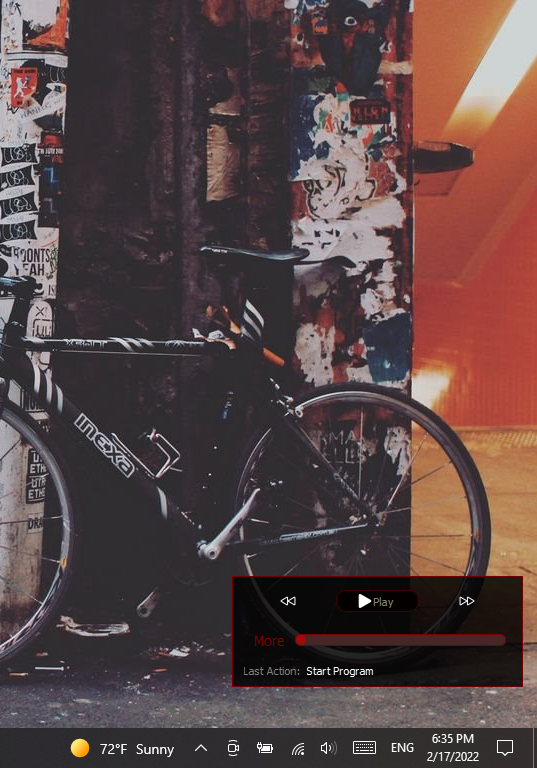

# REDLINE
**Redline** is a red-black music player.<br/>

<div dir="rtl">
خط قرمز، یک پخش کننده موسیقی قرمز-مشکی است
</div>

<br/>



## Table of contents
* [Support](#support)
* [Licence](#Licence)
* [Technologies](#technologies)
* [Setup Windows](#setup-windows)
* [Setup Linux](#setup-linux)
* [Usage](#usage)
* [Download](#download)
* [Note](#note)

___
## Support
If you used this project or learned something please give this project a star to keep doing open source projects

___
## License
Copyright &copy; 2021+ All rights reserved.

___
## Technologies
Project is created with:
* PyQt5==5.15.6
* PyQt5-Qt5==5.15.2
* PyQt5-sip==12.9.1

___
## Setup Windows
Open CMD or PowerShell in the folder and type:
```
> virtualenv .venv
> \.venv\Scripts\activate.bat
> pip install -r requirements.txt
> python src\main.py
```
___
## Setup Linux
To be able to run it you have to open the terminal in the folder and type:
```
$ virtualenv .venv
$ source .venv/bin/activate
$ pip3 install -r requirements.txt
$ python3 src/main.py
```

___
## Usage
<div dir="rtl">
دستورالعمل خط قرمز:

بعد از بازشدن برنامه، دکمه پخش کننده غیرفعال خواهد بود؛ بنایرین لازم است عملیات زیر را انجام دهید:

1. از دکمه های میانبر
```Ctrl + O```
استفاده کرده و فایل های موسیقی خود را وارد برنامه کنید
2. سپس با انتخاب دکمه پخش میتوانید به موسیقی خود گوش دهید


* برای توقف کردن پخش میتوانید از دکمه توقف یا دکمه
```Space```
استفاده کنید
* برای خروج از برنامه از دکمه
```Enter```
استفاده کنید
* برای عقب و جلو کردن موسیقی از دکمه های جهت نمای راست و چپ استفاده کنید
* برای کاهش یا افزایش صدا میتوانید از دکمه های جهت نمای بالا و پایین استفاده کنید
* بطور خودکار بعد از اتمام موسیقی فعلی، موسیقی بعدی پخش خواهد شد. میتوانید با دکمه های تعبیه شده، موسیقی بعدی یا قبلی را پخش کنید یا با انتخاب موسیقی دلخواه خود از لیست موسیقی ها و انتخاب دکمه پخش کردن، میتوانید موسیقی دلخواه خود را بشنوید
* برای پشتیبانی کردن از فرمت ها و کدک های بیشتر میبایست کدک مربوطه را نصب کنید که فایل نصبی آن همراه برنامه ارائه شده است
* و در آخر، حتما به بخش
```About```
سر بزنید

</div>

___
## Download
To download executable file:

* For Windows 7 or later [Click Here](https://drive.google.com/file/d/1-z2axooUYpys7c66ELHPzjdt8GkLcqh-/view?usp=sharing)

____
## Note
Linkedin Profile [Here](https://www.linkedin.com/in/iamrezamousavi)
